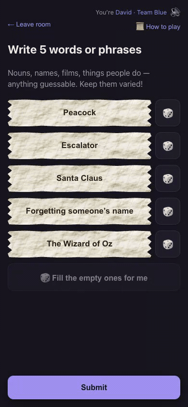
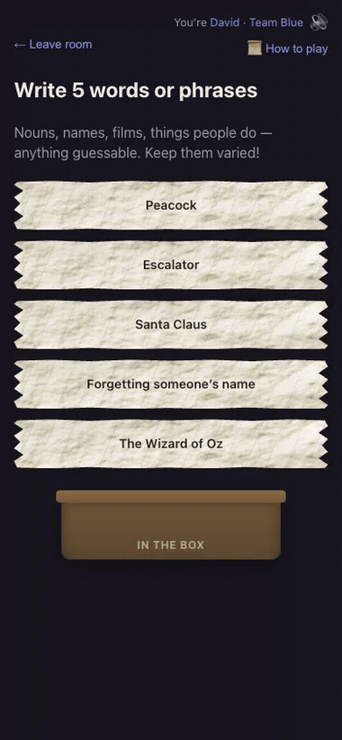
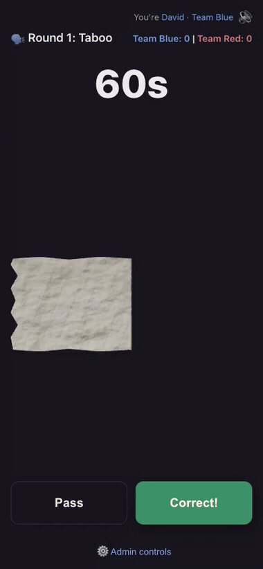
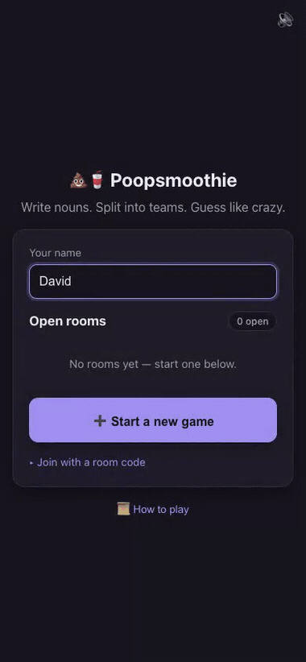

# poopsmoothie

Digital version of Poopsmoothie, a homemade Celebrity variant: everyone writes
words/phrases on slips, splits into two teams, and plays three rounds against
the clock using the *same* slips each round — Taboo, Charades, Password.
Real-time multiplayer over LAN, single Docker container, room-code lobbies.
No cloud, no accounts — everyone just opens a link on the same wifi.

| A sheet becomes slips | You write on them | Fold them into the box |
|---|---|---|
|  |  |  |

| Your turn | The table fills up |
|---|---|
|  |  |

<sub>All recorded automatically — `npm run record` drives a real browser through a
whole game while bots play the other seats. See [Recording the GIFs](#recording-the-gifs).</sub>

## Quick start — game night on your wifi

**Pick one machine to be the host** — anything that can run Docker and stays
on for the night: a NAS, a spare mini-PC, or your own laptop.

- **macOS/Windows:** install [Docker Desktop](https://docs.docker.com/get-started/get-docker/)
  and **launch it** — the daemon has to actually be running, not just installed.
- **Linux / NAS:** Docker Engine + the Compose plugin (Synology/QNAP ship this
  as the Container Manager / Container Station package).

Check it's ready — this must print a version, not `Cannot connect to the Docker
daemon`:

```sh
docker compose version
```

Then pull and run the published image (no source checkout, no build step):

```sh
docker compose -f docker-compose.prod.yml up -d
```

That pulls **`ghcr.io/david-chau/poopsmoothie:latest`** — multi-arch
(amd64 + arm64), so Intel and ARM boxes both work. Published builds are listed
[here](https://github.com/users/david-chau/packages/container/poopsmoothie/versions).

Find the host's LAN IP to share — macOS: `ipconfig getifaddr en0`; Linux:
`hostname -I`; or check your router's device list. Everyone browses to
`http://<that-ip>:4321`.

> **IP changes every night?** Give the host a name instead:
> - **No setup:** most devices already resolve `<hostname>.local` (Bonjour on
>   macOS, avahi on Linux) — `http://<hostname>.local:4321`. A few older
>   Android phones can't resolve `.local`.
> - **A real name (`ps.game`):** needs a DNS override every guest device will
>   use — a static DHCP reservation + your router's local DNS (Pi-hole,
>   dnsmasq, or a consumer router's "Local DNS" setting). Worth it for a
>   recurring game night; skip it for a one-off.

1. **Open that URL yourself first.** Whoever creates the room is the
   **host**, and only the host gets settings and the admin controls.
2. Enter your name, tap **Start a new game** → you get a 4-letter code. Hit 📋
   to copy an invite link for your group chat — it opens straight to the join
   screen.
3. Everyone else opens the same URL and taps your room in the **Open rooms**
   list — no code to read out. They land on whichever team is short (Blue on a
   tie). Typing a code still works, tucked under *Join with a room code*.
4. Need bodies? Host-only in the lobby: **🤖 Fill to 4** adds bots that write
   their own words and play their own turns. Good for a demo or for testing
   with two real people.
5. Host taps **Start game** at 4+ players. A sheet of paper gets cut into slips,
   then everyone writes their words — the 🎲 buttons fill boxes for anyone
   who's stuck.
6. Game auto-advances to Round 1 once everyone's submitted.

When you're done:

```sh
docker compose -f docker-compose.prod.yml down    # rooms in ./data survive
```

**If guests can't reach it:** the URL is `http`, not `https` — some phones
auto-upgrade, so paste the full `http://192.168.x.x:4321` rather than typing
the bare IP. Also check they're on the same wifi band/network (guest wifi is
usually isolated from the main one), and that macOS didn't firewall Docker
(System Settings → Network → Firewall → Options).

**For voice chat specifically:** browsers only allow microphone access on a
secure origin, so the mic toggle only shows up over `https://192.168.x.x:4322`
(port **4322**, not 4321). Self-signed certificate — the browser will warn
once per device; that's expected for a self-hosted server, not a sign
anything's wrong. Text chat, and the rest of the game, work fine on the plain
`http://` URL; only the mic needs the `https` one. The chat panel says so
itself, with a link, when it notices you're on an http origin and the server
does have voice — so "where did the mic go?" answers itself in the app rather
than here. (Browsers don't merely block `getUserMedia` on an insecure origin,
they don't define `navigator.mediaDevices` at all, which is why this is a
different URL rather than a permission prompt.)

(Building from source instead of pulling the image? See
[Option A](#option-a--build-on-the-host) below.)

## How to play

Full rules are also in-app: tap **📜 How to play** on the home screen, lobby,
or writing screen (native modal, works anywhere before a round starts).

1. Everyone writes a few words or phrases — one per slip, anything guessable.
2. Split into **Team Blue** and **Team Red**.
3. Play 3 rounds with the *same* slips every time:
   - **🗣️ Round 1 — Taboo**: describe it any way you like — just don't say the
     word, spell it, or say what it rhymes with.
   - **🎭 Round 2 — Charades**: act it out. No talking, no sounds.
   - **🔑 Round 3 — Password**: one single word as a clue. That's it.
4. On your turn you've got a timer to get your team guessing as many slips as
   you can. Correct? Straight to the next one — same drawer keeps going until
   time's up. Stuck? Pass it and come back around.
5. When time runs out, whatever's still in your hand goes back in the pile for
   next time.
6. Most correct guesses across all 3 rounds wins. MVP (top scorer) is called
   out per team on the final scores screen.

### Host reference

Beyond the Quick start walkthrough above, good to know while hosting:

- **Lobby settings** (host-only): teams auto-balance, and anyone can move
  themself between them (host can move anyone). **Words per player** and
  **turn seconds** are also host-only. Room code has a 📋 copy button.
- **Hot join** (on by default): latecomers can drop into a game already in
  progress — they slot into the turn rotation and start playing from the next
  round's slips. They don't contribute words, since the pool is already built.
  Turn it off and the doors shut when the game starts. This is the one setting
  the host can still change mid-game.
- **⚙️ Admin controls** on the turn screen — for when something goes sideways
  mid-game:
  - **Skip stuck drawer** (AFK/dropped — same team, next player) / **Force
    pass to other team** (ends the turn outright, hands it over)
  - **Pause game** for a real-world interruption; host or drawer resumes
  - **Revert last correct word** if something got scored by mistake
  - **Who guessed what** — a word × round table for re-attributing any
    already-guessed slip. Team scores are derived from it, so there's no way
    to nudge a score away from what actually happened
  - **Hand this turn to someone else** when the wrong person went
- **The host seat never goes to a bot.** Bots have no UI, so handing one the
  room leaves the admin controls with nobody — which used to happen on every
  refresh in a solo-plus-bots game. If no human is connected the seat simply
  waits for the absent host rather than moving.
- **End room for everyone** (host-only): in the lobby settings, and under
  **⚙️ Admin controls → Danger zone** once the game is running. *Leave room*
  only removes you and leaves everyone else in a lobby you've abandoned.
- **Kick a player** (host-only): from the lobby roster, or **⚙️ Admin controls
  → Remove a player** once the game is running. They're sent back to the home
  screen with a reason; if it was their turn, it passes on rather than
  stranding the round.
- **Your name is your identity**, and names are unique within a room.
  Reconnecting is automatic — a dropped signal or reloaded tab picks back up in
  the same room, same team, same turn, current word in hand. If the device lost
  its saved session entirely (cleared storage, flat battery, borrowed phone, or
  the server restarted under you), just rejoin with **the same name**:
  - if that name is **still connected**, you get an error — a seat is never
    taken from someone actively playing. That check probes the socket rather
    than trusting the last-known flag, so a device you just put down doesn't
    lock you out of your own name;
  - if it's **offline**, you're asked to confirm ("already in this room but
    offline — join back as them?") and then get the slot back with its team and
    score attribution, even if hot join is off. If you were host and the seat
    was only handed on *because* you dropped, it comes back with you; a
    connected host who took over keeps it, so a flaky phone can't yank control
    mid-game.
- **Between rounds** the next round is held shut until everyone taps **I'm
  ready**, on a screen showing the round that just finished and the running
  total. The host can **Start the round now** to skip the wait, and the gate
  re-opens by itself if someone drops out mid-recap. There's no gate into the
  final scores — that screen is the recap. (This used to be a modal over a live
  round, which meant the next drawer could start their turn while everyone else
  was still reading.)
- **Guessed this round** is listed for everyone during play, with who got each
  one. Scoped to the current round on purpose: the pile resets each round and
  remembering the earlier rounds' words is the game.
- **Chat & voice (beta)** — off by default, a lobby setting the host turns on
  per room (**Chat & voice (beta)** checkbox, alongside Hot join). Everything
  below only exists once it's on.
- **Chat** on the turn screen is a live audit trail for the current round only
  ("I said Titanic before the buzzer") — cleared when the next round starts.
  Names are team-colored, the drawer gets a badge, and you can filter to
  **All**, **My team**, or **Drawer** so the other team's chatter doesn't
  flood the log.
- **Voice chat** (open mic — no push-to-talk): tap 🎤 to let the table hear
  you, transcribed automatically into the same chat log (🎤 marks a voice
  line). It needs `https` — see below — and only appears once the server
  actually has the speech models loaded. **Voice language** (English or 中文,
  in lobby settings, only once Chat & voice is on) picks which one — one at a
  time, never both, since mixing them made transcription noticeably worse. If
  several phones catch the same thing said out loud, only one line shows up,
  attributed to whoever said it — not whichever phone happened to catch it
  loudest. **Voice ID** (next to the mic toggle) lets you record a short
  sample once so you're still credited correctly even on someone else's
  phone; skipping it is fine, chat still works, it's just occasionally
  attributed to whoever's phone caught it. Only text is ever stored — raw
  audio is discarded the instant it's transcribed/matched.
- **Sound.** Correct guesses, passes, submitting your words, someone joining,
  the last 10 seconds of a turn (soft, firming up for the last 3), time-up,
  each round closing, and a fanfare on the final scores. Room-wide moments play off the broadcast state,
  so *everyone* hears a correct guess, not just the drawer who tapped it.
  The 🔊/🔇 toggle in the top-right silences sound **and** vibration, per
  device, and is remembered.
- **Play again** (host-only, on the final scores): reopens the lobby around the
  same people with the same settings — same room code, nobody rejoins, scores
  reset. Leave/Play again stay pinned to the bottom of that screen rather than
  below a long scroll.
- **Idle phones stay in the game.** Only the drawer is looking at their screen;
  everyone else puts theirs down, and a suspended mobile tab stops answering
  socket pings. So the disconnect timeout is deliberately *generous* (~85s of
  silence) rather than eager — "connected" drives the turn rotation, the ready
  gate and the writing auto-advance, so dropping idle players skips their turns
  and can stall a round. The one case where waiting hurts — picking up a second
  device and finding your own name in use — is handled precisely instead, by
  probing that one socket at that moment. A genuinely stuck drawer has the
  host's **Skip stuck drawer**.
- **Crash recovery.** If the container restarts mid-game (power blip,
  redeploy), it reloads paused; the active drawer just taps **Resume**.

## Dev

```sh
npm install
npm --prefix client install
npm run dev           # client (:5173) + server (:4321) together
```

Or run them separately: `npm run dev:client` / `npm run dev:server`
(server auto-restarts on change via nodemon, scoped to `server/` only — it
does *not* watch `data/`, so gameplay writing room state to disk won't
trigger a restart loop).

To test from a phone on the same wifi, use your machine's LAN IP instead of
localhost, e.g. `http://192.168.x.x:5173`. Vite's dev server proxies
`/socket.io` through to the backend on `:4321` automatically, and binds
`0.0.0.0` so phones can reach it.

### Tests

```sh
npm test          # server + bots: node:test (server/*.test.js, scripts/*.test.mjs)
npm run test:client  # client: vitest + jsdom (src/**/*.test.tsx)
npm run test:all     # both of the above (fast, no Docker)
npm run test:e2e     # full Docker e2e (slow; builds + runs the image)
```

- **`server/game.test.js`** — round engine: pool, scoring, stale-action
  rejection, timeout/pass/skip/force-pass, resume time-banking, per-round
  skip, team alternation, stranded-turn recovery.
- **`server/rooms.test.js`** — team balance, secret auth, `setTeam`
  authorization, host transfer, room lifecycle.
- **`server/persist.test.js`** — atomic save/load round-trip, 24h idle purge,
  corrupt-file skip.
- **`server/events.test.js`** — socket integration over a real wire: auth
  gating, config clamp/merge, join gating, slip secrecy, rejoin.
- **`scripts/bot.test.mjs`** — bots join, auto-submit, and auto-play a turn
  end to end against a live server.
- **`client/src/**/*.test.tsx`** — screen logic: join-link prefill, pass
  gating, winner/MVP, waiting ratio, start gating, plus `lib` helpers.
- **`scripts/e2e.mjs`** (`npm run test:e2e`) — against the **real Docker
  image**: builds it, runs a full game through bots, then does an actual
  `docker restart` mid-turn and verifies crash recovery (reloads paused,
  drawer rejoins + resumes). Isolated image/container/port + a temp data dir,
  so it never touches a running stack or your real `./data`. Skips cleanly if
  Docker isn't installed.

### Recording the GIFs

```sh
npm run record        # -> docs/media/*.gif
```

Drives a real browser as the host while three bots fill the table and play
their own turns, so a whole game records with no human input. It runs its own
server on port 4398 with a throwaway data dir, so it never touches a running
dev server or your real `./data`.

Uses the **system Chrome** (`channel: 'chrome'`) rather than downloading one, so
`playwright` is a small devDependency. Video capture needs Playwright's own
bundled ffmpeg once (`npx playwright install ffmpeg`, ~1MB), and the GIF step
needs `ffmpeg` on PATH — without it the `.webm` is still written.

The script marks when each scene starts and slices the recording at those
marks, so the clips follow the animations rather than hard-coded timestamps
that would drift. Two things worth knowing if you change it:

- Playwright's webm carries irregular timestamps and **cannot be seeked
  accurately** — slicing it directly yielded clips of entirely the wrong scene.
  It's re-encoded to a constant frame rate first.
- GIFs are built in two ffmpeg passes (`palettegen` then `paletteuse`). A
  single pass quantises to a generic palette and visibly bands the paper.

Tune `FPS` and `WIDTH` at the top of `scripts/record.mjs` if the files are too
heavy; they're ~0.4–1.5MB each at the current settings.

### Testing with fewer devices than players

Bots write their own words and play their own turns (random correct/pass with a
short delay), so you can hit the 4-player minimum with 1-2 real devices.

**From the UI** (host-only, lobby): **🤖 +1** / **🤖 Fill to 4** / **Remove
bots**. Best for a demo — no terminal needed. Bots get real names behind a
reserved `[🤖] ` prefix (`[🤖] Jill`) that people are refused if they try to
type it: names are the identity here, so a human "Jill" and a bot "Jill" would
be indistinguishable on the one field that decides who you are. Bots write real phrases by asking
for suggestions through the same `suggest-words` event the 🎲 buttons use, so
their words are playable and de-duplicated against everyone else's.

**From the CLI**, against any running server:

```sh
npm run bots -- ABCD 2   # add 2 bots to room ABCD
```

Both use the same factory (`server/bot.js`) — real socket.io clients that join
through the normal `join-room` door, so turn rotation, pause-on-disconnect and
host transfer all treat them as ordinary players with no special-casing.

## Deploy (any Docker host on your LAN)

Serves on `:4321` (single container — Express + socket.io serve the built
React app and the WebSocket API from the same origin, no separate frontend
container). Maps `4321:4321` and mounts `./data:/data` for room persistence.

### Option A — build on the host

For local dev/testing (checking a change actually works in the container) —
not the game-night path, which pulls the published image (see Quick start
above, or Option B).

```sh
./scripts/startLocalDocker.sh   # build + up + print the LAN URL to share
./scripts/stopLocalDocker.sh    # after
```

(Thin wrappers over `docker compose up -d --build` / `down`; the start one
polls until the server actually answers, since `up -d` returns before it's
listening.)

Needs the source on the box and ~1GB RAM for the client build. Fine on a dev
machine or most NAS/mini-PC hardware.

### Option B — pull a prebuilt image (recommended for an always-on host)

The host machine just pulls — no source checkout, no build RAM needed there.
`docker-compose.prod.yml` uses `image:` instead of `build:` and already points
at the published image, so it's the same command as the Quick start:

```sh
docker compose -f docker-compose.prod.yml up -d
docker compose -f docker-compose.prod.yml pull   # grab a newer :latest later
```

| | |
|---|---|
| Image | `ghcr.io/david-chau/poopsmoothie:latest` |
| Platforms | `linux/amd64`, `linux/arm64` |
| All versions | [ghcr.io package versions](https://github.com/users/david-chau/packages/container/poopsmoothie/versions) |

Every publish also pushes a `YYYYMMDD-HHMM` tag. Pin one via `PS_IMAGE` to roll
back, or to point at a different account entirely:

```sh
PS_IMAGE=ghcr.io/david-chau/poopsmoothie:20260725-1210 \
  docker compose -f docker-compose.prod.yml up -d
```

**Publishing your own build** (only needed if you've changed the code):

```sh
# once: auth (classic token with write:packages)
echo "$GITHUB_TOKEN" | docker login ghcr.io -u <your-gh-user> --password-stdin
# builds both arches, pushes :latest + a timestamp tag
GHCR_USER=<your-gh-user> ./scripts/publish.sh
```

`GHCR_USER` picks the account; the optional first argument is the version tag.
Runs from any directory.

To pull without `docker login`, the GHCR package must be **public** (GitHub →
your profile → Packages → poopsmoothie → Package settings → visibility).

Room state persists to `./data/rooms/*.json` on the host — survives a
container restart mid-game; players just reload and rejoin, drawer taps
Resume. Rooms are cleaned up automatically: deleted when the last player
leaves, and any file idle >24h is purged on the next boot, so `data/` doesn't
grow without bound. Not yet load-tested beyond dev — worth a real run-through
on whatever box you pick before a real game night to catch any
environment-specific gaps (LAN discovery, port conflicts, etc).

## Architecture

One container, one port, one origin — the same express server hands out the
built React app *and* speaks socket.io, which is why phones need no CORS setup
and no second URL.

```
              phones / laptops on the same wifi
                            │
                            │  http://<host-ip>:4321
                            ▼
┌──────────────────── container :4321 ────────────────────┐
│                                                         │
│  index.js  ─┬─ GET /*      ──▶  client/dist  (SPA)      │
│             └─ /socket.io  ──▶  socket.io               │
│                                    │                    │
│                                    ▼                    │
│                               events.js                 │
│              identity read from socket.data,            │
│              never trusted from the payload             │
│                    │                                    │
│         ┌──────────┼───────────────┬─────────────┐      │
│         ▼          ▼               ▼             ▼      │
│     rooms.js    game.js     suggestions.js    bots.js   │
│     roster,     phases,     🎲 word pool         │      │
│     codes,      turns,                           │      │
│     teams,      scoring,                    spawns      │
│     host        timers                           │      │
│                                                  ▼      │
│                                              bot.js     │
│                                        (socket.io       │
│                                         client that     │
│                                         loops back in   │
│                                         as an ordinary  │
│                                         player) ──┐     │
│                    ┌──────────────────────────────┘     │
│                    ▼                                    │
│           persistAndBroadcast()                         │
│             ├─ io.to(code)  'state'    counts, no text  │
│             ├─ io.emit      'lobbies'  open rooms, all  │
│             └─ persist.js  ──▶  /data/rooms/<CODE>.json │
│                                          │              │
│           sendSlipToDrawer()             │              │
│             └─ io.to(drawerSocket)       │              │
│                'slip-revealed' — the     │              │
│                only place slip text      │              │
│                leaves the box            │              │
│                                          │              │
└──────────────────────────────────────────┼──────────────┘
                                           │
          bind mount, from compose:        │
                 ./data:/data              │
                                           ▼
              ┌──────────────────────────────────────────┐
              │  host disk   ./data/rooms/<CODE>.json    │
              │  survives container restart, redeploy    │
              │  and image update — this is why a crash  │
              │  mid-game resumes instead of vanishing   │
              └──────────────────────────────────────────┘
```

Every state-changing handler ends the same way: mutate in memory → save to disk
→ broadcast. Nothing is written straight to a socket without going through the
sanitizing `publicState()` first.

```
server/
  index.js       express + socket.io bootstrap, serves SPA, boot recovery,
                 https listener (mic prerequisite), voice model loading
  rooms.js       room/player CRUD, 4-char codes, team balance, host transfer
  game.js        round/turn state machine — pool, timers, pass/skip, host
                 patch controls (revert, set-drawer, set-slip-scorer); scores
                 are derived from pool[].scoredBy, never accumulated
  persist.js     atomic (tmp+rename) JSON writes, load-all-on-boot
  events.js      socket event wiring, auth, sanitized public state broadcast
  suggestions.js word/phrase pool for the 🎲 buttons, deduped against the room
  bot.js         bot factory — a socket.io client that plays itself
  bots.js        host-spawned bot lifecycle, one-time join tokens, teardown
  tls.js         self-signed cert, generated once and persisted to DATA_DIR
  stt.js         sherpa-onnx wrapper: VAD -> streaming ASR -> speaker embedding
  arbiter.js     cross-device dedup (same shout, several phones) + voice match

client/src/
  GameContext.tsx   socket connection, rejoin, clock-skew offset, game state
  socket.ts         socket.io client singleton + identity persistence
  useOpenMic.ts     getUserMedia -> AudioWorklet -> 16kHz frames over the socket
  types.ts          shared types, team/round label+color/icon maps
  screens/          Landing, Lobby, Writing, Turn, RoundIntermission, Scores
  alert.ts          all game sounds + vibration (Web Audio, no asset shipped)
  components/       PaperCutIntro (sheet -> slips), PaperSlip (3D hinge
                    reveal), FoldingSlip (fold into the box), Confetti,
                    RulesDialog,
                    PlayerName, MyNameBadge, AdminDrawer, Toast,
                    SoundToggle, GameSounds, TurnChat (text + voice audit
                    trail), VoiceEnroll (one-shot voiceprint recording)

public/
  audio-worklet.js  mic downsampling — plain script, deliberately unbundled
```

**No room passwords, deliberately.** Rooms are listed openly on the landing
screen and anyone who can reach the server can join one. That's the right trade
for the target: a LAN game where everyone is in the same living room, and the
alternative is reading a code out loud to people sitting next to you. Reclaiming
a slot by name follows the same logic — it's weak proof of identity, but no
weaker than the rest of the model. **The security boundary is the network, not
the app** — don't expose this to the public internet as-is. If you ever host it
publicly, room passwords are the first thing to add.

**Not built, because the LAN assumption removes the need.** Worth revisiting
only if this is ever hosted publicly:
- **Spectator mode** — everyone is in the same living room watching the same
  drawer, so a watch-only seat adds nothing. Over the internet it would be the
  natural way to let extra people follow along without joining a team.
- **Room passwords / invite-only rooms** — see above.
- **Per-room word packs** — a shared theme ("films only", "inside jokes") is
  fun but the 🎲 suggestions plus everyone writing their own already covers it.

What *is* hardened, because these bite even on a friendly LAN:
- Every socket handler is wrapped so a malformed payload can't throw out of the
  handler. Without it, one bad message (`join-room` with a non-string code, or
  a literal `null` payload) became an uncaughtException and killed the server
  for every room on the box.
- Rejoin secrets are stored **hashed** (sha256, constant-time compare), so a
  room file on the NAS can't be read to impersonate a player. Old files with
  plaintext secrets migrate themselves on first load.
- Room creation is rate-limited per socket and capped globally, so a loop can't
  fill the disk with room files.
- Config values are clamped with a NaN guard — `wordsPerPlayer: NaN` used to
  make a room permanently unable to start, with no UI to recover.

**Design notes worth knowing before touching this again:**
- Server is fully authoritative; client never computes game logic, only
  renders state and captures input.
- Slip *text* is never broadcast to the room — only sent to the current
  drawer's socket, and only revealed to everyone in the final pool at
  end-of-game. The public `state` payload carries counts, not text.
- Timers use an absolute `turnEndsAt` + `serverNow` pair so clients can
  correct for their own clock being wrong, not a ticking countdown from the
  server.
- Voluntary "Leave room" fully removes the player slot; an involuntary
  disconnect just marks them offline and keeps the slot for reconnect —
  these are deliberately different code paths.
- The paper is the whole metaphor, so the slips behave like paper. You *write*
  on a slip (painted paper behind a transparent input), fold it down the centre
  and drop it in the box on submit, and a drawn slip is *unfolded*: one half
  hinges around the crease from rotateY(-180°) to 0°, showing its blank back
  until it opens. It is deliberately not a scaleX stretch — that grows the
  writing along with the paper, which real paper doesn't do. Both halves render
  the same full-width face and clip to their own side, so the phrase reads
  across the crease. You hold the left half and the *right* one is the flap —
  hinge the other and the slip sits on the right and opens leftward, which reads
  as running backwards. The flap's back is a shade darker than its front, or a
  fold onto identical paper just merges into the half beneath it; and the held
  writing screen opens by cutting a sheet into slips, built as the finished
  slips already stacked edge to edge so the "cut" is the gaps opening between
  them — which is also what lands the strips exactly where the rows appear,
  instead of needing two layouts to agree pixel for pixel. The
  ink is plain, with no fade — opening the paper *is* the reveal, and you read
  more of the phrase the further the flap swings. Slips are then *handled* the
  way the real ones are: drawn up out of the box below, and leaving by whichever
  route matches what happened to them — a guessed one is lifted away still open
  (nobody refolds one they just won), a passed one folds shut and drops back in,
  because it will come round again. A turn that simply runs out is treated as a
  pass, since that slip does go back in the bag. Each phase waits for the last,
  or it reads as one slip morphing rather than paper being handled. The whole
  chain is ~1s and plays after every guess, so the constants at the top of
  PaperSlip.tsx are the knob if it ever feels long mid-turn. Submitting runs the same
  hinge in reverse, in place on the writing screen, and the slips fold and drop
  into a box **before** anything is sent — you fold your paper and put it in the
  box, and only then are you ready. Two things here are
  easy to get subtly wrong and are pinned by tests: `.paper-surface` paints and
  never positions (its `inset: 0` once over-constrained the halves so both showed
  the same side of the phrase), and both faces pin to the same edge with the
  right one shifted, never one-left-one-right. The slip is also a deliberately
  *flat* stacking context with the perspective on it — `preserve-3d` there
  depth-sorts the halves, making `z-index` inert and leaving the flap to flicker
  and settle *under* the half it folds onto. All of it is skipped under
  `prefers-reduced-motion`.

**Voice chat pipeline**, in order:

1. **Capture** (client): `getUserMedia` (open mic, no push-to-talk) feeds an
   `AudioWorklet` (`public/audio-worklet.js`) that downsamples whatever rate
   the device gives to 16kHz mono Int16 and streams ~250ms frames over the
   existing socket as `audio-frame` — `.volatile.emit`, so a frame queued
   behind a dropped connection is discarded rather than delivered stale.
   Kept short deliberately: whatever's left in the buffer when someone stops
   talking waits for the next full frame before the server's VAD even sees
   the silence that ends the segment — that tail wait was the visible
   majority of the delay before a line showed up.
2. **VAD** (server, per socket): silero-vad gates everything downstream —
   ASR only runs on segments it flags as actual speech, which is most of the
   CPU story on a NAS of uncertain power. Each segment is widened with ~300ms
   of **pre-roll** audio the segmenter keeps in its own rolling buffer: the
   VAD marks speech from where it is *confident*, which reliably clips a
   quiet leading word ("The Tooth Fairy" came back as "Tooth fairy" until
   this was added). Tuning the VAD's thresholds instead was tried and
   rejected — the only value that recovered the word was also the most eager
   to call a cough speech.
3. **ASR** (server, shared across the room): transcribes each segment in
   whichever single language the room picked (**Voice language** in lobby
   settings — English or 中文, never both). A combined bilingual model was
   tried first and dropped: trained on Mandarin/English code-switching
   speech, it was biased toward hearing Chinese even from a pure-English
   speaker — no config fixed it, only one single-language model per option
   did. Because the VAD segments *first*, only ever handing over a complete
   utterance, these are **offline** models rather than streaming ones: they
   are markedly better on the short phrases people actually say across a
   table, which is where a streaming zipformer turned "The Tooth Fairy" into
   "THE TWO FA". Runs behind `TranscriptionQueue`, a server-wide concurrency
   cap (`PS_STT_MAX_CONCURRENT`) — excess load sheds the oldest queued
   segment rather than letting transcription lag pile up.

   Which model each language uses is a Dockerfile concern, not a code one:
   every language directory carries a `model.json` naming its `kind`
   (`offline`/`online`), so swapping in a lighter model is a URL change. The
   English default (NeMo parakeet-tdt-0.6b) is the most accurate option
   tested and also the heaviest — **`npm run stt-bench` on the actual host is
   the deciding vote**, and the Dockerfile names the lighter fallback inline.
4. **Cross-device dedup** (`server/arbiter.js`): the same shout often lands on
   several phones. Utterances are held ~0.4s (`PS_VOICE_SETTLE_MS`), clustered
   by time overlap + text similarity, and only the best capture (loudest, then
   longest) becomes one chat line — this alone fixes the common case, since
   the true speaker's own phone usually also heard them. This is pure added
   latency for the (common) single-speaker case, so it's kept short — long
   enough to absorb two phones' VAD/network jitter, not much more.
5. **Voice match** (optional, per player): a speaker-embedding model fingerprints
   each utterance and compares it against anyone who recorded a sample via the
   **Voice ID** button. A confident match (`PS_VOICE_EMBEDDING_THRESHOLD`)
   overrides step 4's guess — this is what's actually needed when the true
   speaker's *own* phone never captured them at all (pocket, far corner of the
   room), not just when several phones did.

Only the transcribed **text** and (transiently, in memory, for the ~0.4s
settle window) a numeric voice fingerprint ever exist — raw audio is never
written to disk and is discarded the instant each step above is done with it.
Everything server-side is optional and fails soft: no model files, no HTTPS
cert, or a threshold nobody clears just means that layer sits out — text chat
never breaks because of it (`server/index.js` logs which pieces loaded at
boot). `npm run stt-bench -- /path/to/models` measures real decode speed on
whatever box will actually host it, before it needs to work at a party.
