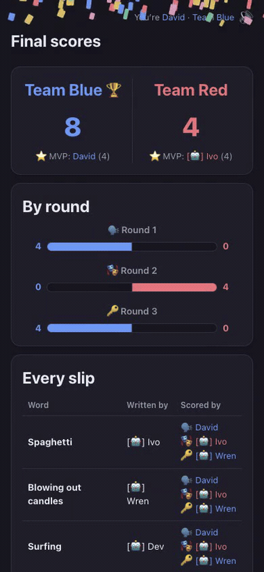

# poopsmoothie

[](https://github.com/david-chau/poopsmoothie/actions/workflows/publish.yml)
[](https://github.com/users/david-chau/packages/container/poopsmoothie/versions)
[](docs/DEPLOYMENT.md)

Digital version of Poopsmoothie, a homemade Celebrity variant: everyone writes
words/phrases on slips, splits into two teams, and plays three rounds against
the clock using the *same* slips each round — Taboo, Charades, Password.
Real-time multiplayer over LAN, single Docker container, room-code lobbies.
No cloud, no accounts — everyone just opens a link on the same wifi.

| **4–12 Players** | **3 Rounds** | **10–300s Turn** | **LAN, self-hosted** |
|---|---|---|---|
| bots fill empty seats | Taboo · Charades · Password | default 60s, host-adjustable | no cloud, no accounts |

| A sheet becomes slips | You write on them | Fold them into the box |
|---|---|---|
|  |  |  |

| Your turn | Lobby | Final scores |
|---|---|---|
|  |  |  |

<sub>GIFs were all  [automatically generated](docs/RECORDING.md).</sub>

## Quick start — game night on your wifi

**Pick one machine to be the host** — anything that can run Docker and stays
on for the night: a NAS, a spare mini-PC, or your own laptop.

- **macOS/Windows:** install [Docker Desktop](https://docs.docker.com/get-started/get-docker/)
  and **launch it** — the daemon has to actually be running, not just installed.
- **Linux / NAS:** Docker Engine + the Compose plugin (Synology/QNAP ship this
  as the Container Manager / Container Station package).

Check it's ready — this must print a version, not `Cannot connect to the Docker
daemon`:

```sh
docker compose version
```

Then pull and run the published image (no source checkout, no build step):

```sh
docker compose -f docker-compose.prod.yml up -d
```

That pulls **`ghcr.io/david-chau/poopsmoothie:latest`** — multi-arch
(amd64 + arm64), so Intel and ARM boxes both work.

Find the host's LAN IP to share — macOS: `ipconfig getifaddr en0`; Linux:
`hostname -I`; or check your router's device list. Everyone browses to
`http://<that-ip>:4321`. (IP changes every night? See
[Detailed setup](docs/DETAILED_SETUP.md) for giving the host a fixed name.)

1. **Open that URL yourself first.** Whoever creates the room is the
   **host**, and only the host gets settings and the admin controls. Enter
   your name and tap **Start a new game**.
2. Everyone else opens the same URL and taps your room in the **Open rooms**
   list — no code to read out. They land on whichever team is short (Blue on a
   tie). If you'd rather send a link (multiple rooms open, or joining
   remotely), hit 📋 on the lobby's room code to copy an invite link that
   opens straight to the join screen — or they can type the 4-letter code
   under *Join with a room code*.
3. Need bodies? Host-only in the lobby: **🤖 Fill to 4** adds bots that write
   their own words and play their own turns. Good for a demo or for testing
   with two real people.
4. Host taps **Start game** at 4+ players. A sheet of paper gets cut into slips,
   then everyone writes their words — the 🎲 buttons fill boxes for anyone
   who's stuck.
5. Game auto-advances to Round 1 once everyone's submitted.

When you're done:

```sh
docker compose -f docker-compose.prod.yml down    # rooms in ./data survive
```

Guests can't connect, or want voice chat (needs `https`)? Building from source
instead of pulling the image? See [Deployment](docs/DEPLOYMENT.md).

## How to play

Full rules are also in-app: tap **📜 How to play** on the home screen, lobby,
or writing screen (native modal, works anywhere before a round starts).

1. Everyone writes a few words or phrases — one per slip, anything guessable.
2. Split into **Team Blue** and **Team Red**.
3. Play 3 rounds with the *same* slips every time:
   - **🗣️ Round 1 — Taboo**: describe it any way you like — just don't say the
     word, spell it, or say what it rhymes with.
   - **🎭 Round 2 — Charades**: act it out. No talking, no sounds.
   - **🔑 Round 3 — Password**: one single word as a clue. That's it.
4. On your turn you've got a timer to get your team guessing as many slips as
   you can. Correct? Straight to the next one — same drawer keeps going until
   time's up. Stuck? Pass it and come back around.
5. When time runs out, whatever's still in your hand goes back in the pile for
   next time.
6. Most correct guesses across all 3 rounds wins. MVP (top scorer) is called
   out per team on the final scores screen.

## Settings

Configurable in the lobby, host-only, before the game starts:

- **Words per player** (1–20, default 5) and **Turn seconds** (10–300, default
  60). Teams auto-balance; anyone can move themself between them (host can
  move anyone).
- **Hot join** (default on) — latecomers can join a game already in progress.
- **Chat & voice (beta)** (default off) — round chat plus open-mic voice
  transcription, with a **Voice language** picker once it's on. Voice needs
  models on the host first (not shipped in the image, to keep it small):
  `./scripts/fetch-models.sh`, then restart the container. See
  [Deployment](docs/DEPLOYMENT.md#voice-models).

Also available while hosting: host-only **⚙️ Admin controls** during the game
(pause, skip a stuck drawer, revert a score, remove a player, end the room),
automatic reconnect/crash recovery, and a per-device 🔊/🔇 sound toggle.

Full behavior, edge cases, and the chat/voice pipeline:
[Settings — detailed](docs/SETTINGS_DETAILED.md).

## Learn more

- **[Architecture](docs/ARCHITECTURE.md)** — system diagram, server/client
  file map, security model, the paper-fold design notes, voice pipeline
  internals.
- **[Development](docs/DEVELOPMENT.md)** — running the dev server, test
  suites, recording the README GIFs, testing with bots instead of extra
  devices.
- **[Deployment](docs/DEPLOYMENT.md)** — building vs pulling the image,
  publishing, data persistence, troubleshooting.
